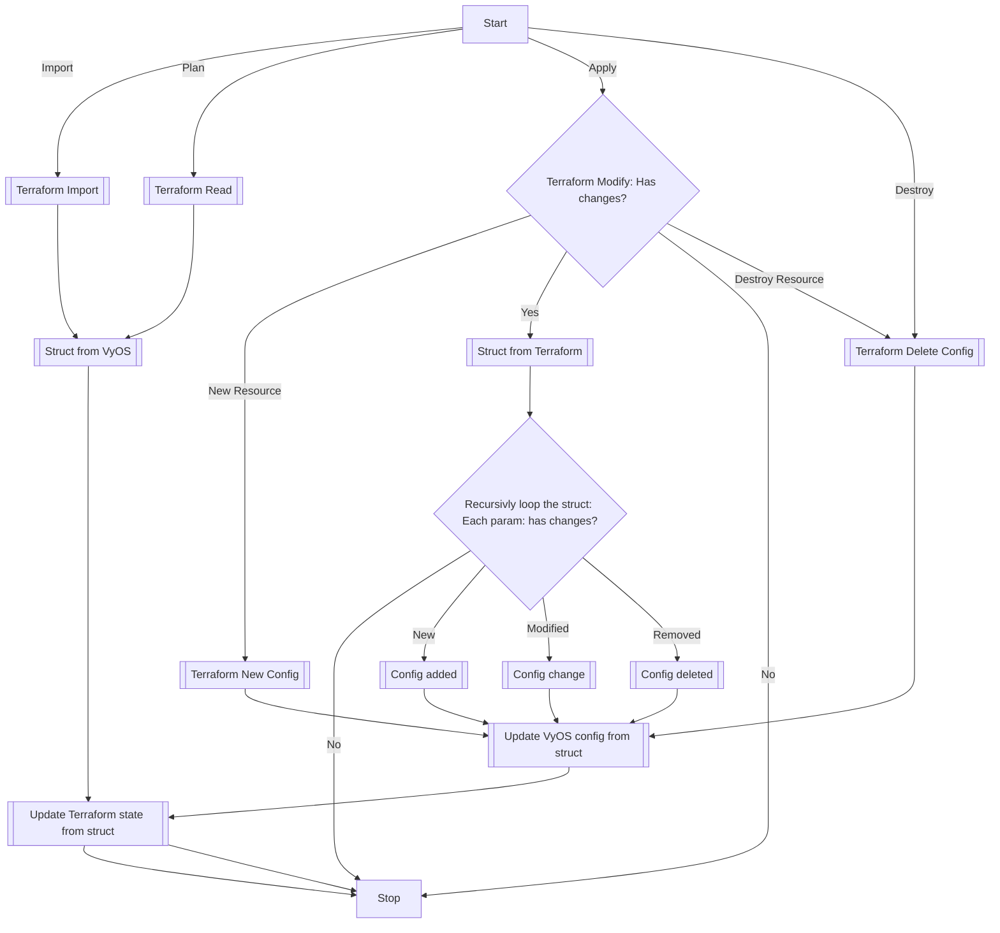

# Helpers diagrams

## 

```mermaid
graph TD
    Start
    Stop

    TFCreate[[Terraform New Config]]
    TFRead[[Terraform Read]]
    TFMod{Terraform Modify: Has changes?}
    TFDel[[Terraform Delete Config]]
    TFImport[[Terraform Import]]

    FromTF[[Struct from Terraform]]
    FromVY[[Struct from VyOS]]
    ToTF[[Update Terraform state from struct]]
    ToVY[[Update VyOS config from struct]]

    Diff{Recursivly loop the struct: Each param: has changes?}
    New[[Config added]]
    Chg[[Config change]]
    Del[[Config deleted]]

    %% Imports
    Start -->|Import|TFImport
    TFImport --> FromVY

    %% Plan
    Start -->|Plan|TFRead
    TFRead --> FromVY
    FromVY --> ToTF
    ToTF --> Stop

    %% Apply
    Start -->|Apply|TFMod

    TFMod -->|New Resource|TFCreate
    TFCreate --> ToVY

    TFMod -->|Yes|FromTF
    TFMod -->|No|Stop
    FromTF --> Diff
    Diff -->|No|Stop
    Diff -->|New|New --> ToVY
    Diff -->|Modified|Chg --> ToVY
    Diff -->|Removed|Del --> ToVY

    TFMod -->|Destroy Resource|TFDel
    TFDel --> ToVY

    %% Destroy
    Start -->|Destroy|TFDel

    %% Update current state
    ToVY --> ToTF --> Stop


```